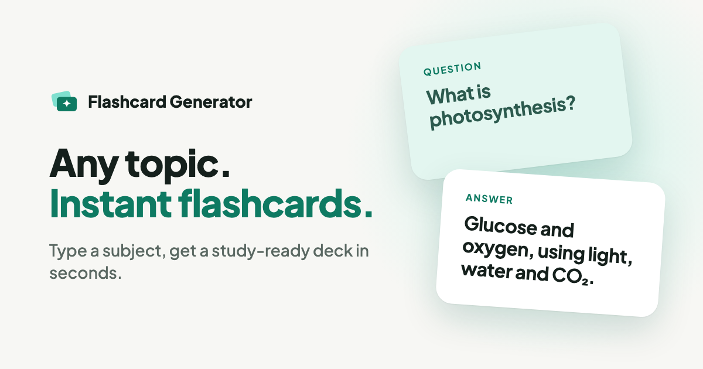

# Flashcard Generator

Type a topic, pick 10, 20 or 30 cards, and Claude writes a study deck. You
can flip through it right away or save it to your account. React and
TypeScript on the front, Firebase Functions behind, with a Stripe
subscription for people who want more than the free deck. Live at
[study.noahgdorfman.com](https://study.noahgdorfman.com/).

<p align="center">
  
</p>

## Why

I built this to prep for job interviews: type in whatever the next one is
likely to cover, get a deck, flip through it.

## How it works

### Generating a deck

The client POSTs `{ topic, count, apiKey? }` to an HTTPS function,
`generateFlashcards` (Firebase Functions v2 `onRequest`, 1 GiB memory, 60s
timeout). The function calls Claude:

- model: `claude-sonnet-4-5`, `max_tokens: 4000`, `temperature: 1`
- a user-turn prompt: generate `${count}` high-quality flashcards about
  `${topic}` as a JSON array of `question`/`answer` objects, with nothing
  else in the reply, and no cite tags
- two tools:
  - `flash_cards`, a custom tool whose input schema is
    `{ cards: [{ question, answer }] }`. It's there only to get structured
    output.
  - `web_search` (`web_search_20250305`, `max_uses: 2`), so decks on
    current or niche topics can rest on something real

Parsing goes in two steps. First, look for a `tool_use` block named
`flash_cards` and take its `cards`. If there isn't one, take the first text
block, cut out everything between the first `[` and the last `]`, and
`JSON.parse` it. If that also fails, the user is told to try a smaller set
or reword the topic. Each card gets a `temp-N` id, the topic and a
timestamp, and the array goes back to the client.

### Who pays for the tokens

Generating requires an account, and the `generateFlashcards` function
verifies your Firebase ID token before it does anything. Then it decides whose
Anthropic key pays:

| Who | Whose Anthropic key |
|---|---|
| Subscribed (or cancellation pending) | the app's |
| Saved their own key | theirs |
| Everyone else, first deck | the app's, once |

The free deck is claimed atomically in the database (`freeGenerationUsed`,
which only the server can write), so two tabs can't both get one. If the
Anthropic call itself fails, the free deck is given back. Anyone past the free
deck without a key or subscription gets a dialog to subscribe or add a key;
the bring-your-own-key option sits under "Advanced Settings" on the Profile
page.

### Subscriptions (Stripe)

Four more HTTPS functions handle billing. Each one checks a Firebase ID
token sent as `Authorization: Bearer ...`:

- **`createCheckoutSession`** finds or creates a Stripe customer by email,
  saves `stripeCustomerId` on the user, and creates a subscription Checkout
  Session with `client_reference_id` set to the Firebase uid.
- **`cancelSubscription`** sets `cancel_at_period_end: true` and marks the
  user `pending_cancellation`. They keep access until the period ends.
- **`reactivateSubscription`** undoes that.
- **`handleStripeWebhook`** verifies the Stripe signature against the raw
  body. `checkout.session.completed` sets the user to `subscribed`.
  `customer.subscription.deleted` looks the user up by `stripeCustomerId`
  and sets them to `unsubscribed`.

The UI only reads `subscriptionStatus` from the database, so every device
and session shows the same state.

### Data model (Realtime Database)

```
users/
  {uid}/
    subscriptionStatus   "subscribed" | "pending_cancellation" | "unsubscribed"
    stripeCustomerId     set by createCheckoutSession
    anthropicKey         optional, user-supplied
    flashcardSets/
      {pushId}/          { title, topic, flashcards[], userId, createdAt }
```

[`database.rules.json`](database.rules.json) locks everything down by
default: you can read only your own user node and write only your own key and
flashcard sets. Subscription status, Stripe customer ID and the free-deck flag
are server-only.

### The UI

- **Auth:** email/password or Google sign-in (popup), through Firebase Auth.
- **Study:** one card at a time. Click the card or **Flip** to switch sides;
  **Previous** and **Next** move through the deck, with a "Card X of N"
  counter. A save icon pushes the deck to `flashcardSets`, or asks you to
  sign up if you're logged out.
- **My Sets:** a live `onValue` listener on your sets, newest first, with
  Study and a confirmed Delete on each.
- **Profile:** subscription status with Subscribe, Cancel or Keep buttons,
  plus the API-key field under Advanced Settings.
- Material UI with a custom theme (deep-green gradient, teal accent, Inter),
  and a hamburger drawer on phones.

Decks reach the Study page through React Router `location.state`, not the
URL. That keeps it simple, but reloading `/study` loses the deck.

## Stack

| Piece | What |
|---|---|
| Frontend | React 18 + TypeScript (Create React App), MUI 5, React Router 6 |
| Auth / data | Firebase Auth, Firebase Realtime Database |
| Backend | Firebase Functions v2 (`onRequest`), TypeScript, Node 22 |
| AI | `@anthropic-ai/sdk`, Claude Sonnet 4.5, custom tool + web search |
| Payments | Stripe Checkout (subscription mode) + webhook |
| Hosting | Static CRA build on Vercel. Its Git integration deploys `main` to production. |

### History, per `git log`

- **May 16, 2025:** first commit. The client called `generateFlashcards` as
  a Firebase **callable** (`onCall`), and the model was
  `claude-3-haiku-20240307`.
- **Same day:** the client moved to a plain `fetch` against an `onRequest`
  function.
- **May 17:** domain moved from `quiz.` to `study.noahgdorfman.com`, plus a
  style overhaul and a run of meta-tag and social-image fixes.
- **May 19–20:** Stripe. Checkout, cancel, resubscribe, and subscription
  state stored in the database, plus a day of CORS logging, URL changes and
  a revert. `createCheckoutSession` moved from `onCall` to `onRequest`
  ("CORS fixes with request instead of onCall").
- **May 26:** Sonnet 4 + web search (`max_uses: 5`), then the same night
  `claude-3-5-sonnet-20241022` with the `flash_cards` tool and
  `max_uses: 2` ("dialed in Anthropic API usage").
- **Oct 8, 2025:** `claude-sonnet-4-5`.

## Running it locally

You'll need Node, the Firebase CLI, a Firebase project with Auth
(Email/Password + Google) and Realtime Database turned on, and a Stripe
account if you want billing.

1. Install dependencies:
   ```bash
   npm install
   cd functions && npm install
   ```
2. Create `.env` in the repo root:
   ```
   REACT_APP_FIREBASE_API_KEY=...
   REACT_APP_FIREBASE_AUTH_DOMAIN=...
   REACT_APP_FIREBASE_DATABASE_URL=...
   REACT_APP_FIREBASE_PROJECT_ID=...
   REACT_APP_FIREBASE_STORAGE_BUCKET=...
   REACT_APP_FIREBASE_MESSAGING_SENDER_ID=...
   REACT_APP_FIREBASE_APP_ID=...
   REACT_APP_FIREBASE_MEASUREMENT_ID=...
   REACT_APP_STRIPE_PUBLISHABLE_KEY=...
   ```
3. Set the function secrets:
   ```bash
   firebase functions:secrets:set ANTHROPIC_API_KEY
   firebase functions:secrets:set STRIPE_SECRET_KEY
   firebase functions:secrets:set STRIPE_WEBHOOK_SECRET
   firebase functions:secrets:set STRIPE_PRICE_ID
   ```
4. Deploy the functions (`predeploy` runs lint and `tsc` first):
   ```bash
   cd functions && npm run deploy
   ```
   Point a Stripe webhook at `handleStripeWebhook` for
   `checkout.session.completed` and `customer.subscription.deleted`.
5. Start the frontend:
   ```bash
   npm start
   ```
   It runs on `localhost:3000`, which is already in the functions' CORS
   allowlist.

Two things to know. The client has the deployed function URLs
(`https://us-central1-<project>.cloudfunctions.net/...`) hardcoded in
`src/services/anthropic.ts`, `Home.tsx` and `Profile.tsx`, so change them
to your own project. The Checkout success and cancel URLs are hardcoded in
`functions/src/index.ts`. `npm run serve` in `functions/` starts the
Functions emulator, but the frontend won't call it unless you change those
URLs.

## Lessons learned

1. **Give the model a schema, then parse defensively anyway.** The
   `flash_cards` tool usually returns clean cards, but tool use isn't
   forced, so the old bracket-slicing JSON parser stays as a fallback.
2. **Web search brings citations you didn't ask for.** The prompt has to
   tell the model not to put cite tags in the card text.
3. **CORS will eat a day.** Getting Stripe checkout past CORS took six
   commits: a switch from `onCall` to `onRequest`, then logging, URL
   changes and one revert.
4. **Let the webhook own the truth.** Storing `subscriptionStatus` in the
   database, written by the webhook and the cancel and reactivate
   functions, is what made the UI agree across sessions.
5. **A `localStorage` free tier is an honor system.** One free deck per
   browser was easy to build and just as easy to clear, so the check moved
   to the server.

## Repo layout

```
src/
  pages/          Home (generate), Study, MySets, Profile, Auth, Success
  components/     Layout: app bar + mobile drawer
  context/        AuthContext (Firebase Auth: email/password + Google)
  services/       firebase.ts (SDK init), anthropic.ts (calls generateFlashcards)
  types/          Flashcard, FlashcardSet, User
public/
  index.html      meta / Open Graph tags
  assets/         logo, social card, favicon
functions/
  src/index.ts    generateFlashcards + Stripe checkout/cancel/reactivate/webhook
firebase.json     Functions config (lint + build predeploy)
```

## Credits

